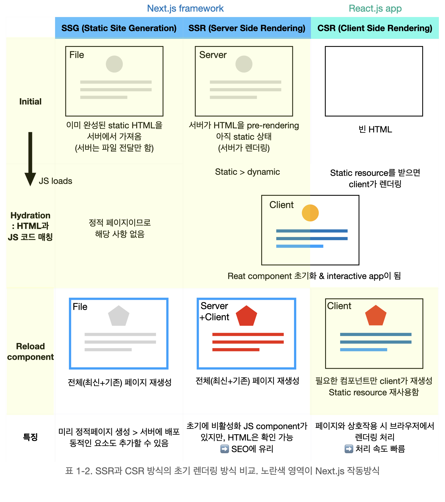

[참고자료 및 이미지 출처](https://velog.io/@skyu_dev/NextJS)

# 왜 NEXT.js인가?

: 프로젝트를 진행하며 프론트엔드 스택으로 Next.js를 사용하기로 결정됨. Next.js가 무엇인지 물어보니 리액트 기반의 CSR 프레임워크라고함. 그러자 생기는 의문점. 우리 프로젝트는 PWA인데 CSR이 가지는 이점이 있나? 그러나 결론! Next.js는 CSR+SSR을 제공하는 하이브리드 앱이었다.

# SSR(server side rendering)

장점 1. SEO에서의 이점 2. 초기 렌더링 빠름
단점 1. 새로 고침 등 요청 시마다 서버가 페이지 전체 렌더링 -> 서버 과부하 2. 개발 복잡성 : 규모에 따라 클라이언트 - 서버 동기화 과정이 복잡해질 수 있음.

# CSR(client side rendering)

장점 1. 서버가 초기 html만 제공 -> 서버 부담 완화 2. 동적 페이지 구현, 페이지 이동 빠름 -> UX 개선
단점 1. 초기 렌더링 오래 걸림 2. SEO에서의 단점 3. 클라이언트에서 많은 로직을 처리하므로 민감한 데이터가 노출될 수 있음

# NEXT.js ?

1. 초기 페이지 로딩에 **SSR** 사용
2. 이후 페이지 이동 및 상호 작용에 **CSR** 사용

- 사용자가 **SSR과 SSG** 중 선택 가능

